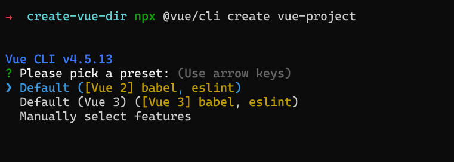

# create-vue-analysis

## 前言

阅读本文，你将学到：

```sh
1. 学会全新的官方脚手架工具 create-vue 的使用和原理
2. 学会使用 VSCode 直接打开github 项目
3. 学会使用测试用例调试源码
4. 学以致用，为公司项目初始化中写脚手架工具。
5. 等等
```

## 2. 使用 npm init vue@next 初始化 vue3 项目

[create-vue github README](https://github.com/vuejs/create-vue)上写着，`An easy way to start a Vue project`。一种简单的初始化vue项目的方式。

```sh
npm init vue@next
```

估计大多数读者，第一反应是**这样竟然也可以，这么简单快捷？**

忍不住想动手在控制台输出命令，我在终端试过，见下图。


最终`cd vue3-project`、`npm install` 、`npm run dev`打开页面[http://localhost:3000](http://localhost:3000)。


### npm init && npx

为啥 `npm init` 也可以直接初始化一个项目，带着疑问，我们翻看 `npm` 文档。

[npm init](https://docs.npmjs.com/cli/v6/commands/npm-init)

npm init 用法：

```sh
npm init [--force|-f|--yes|-y|--scope]
npm init <@scope> (same as `npx <@scope>/create`)
npm init [<@scope>/]<name> (same as `npx [<@scope>/]create-<name>`)
```

`npm init <initializer>` 时转换成`npx`命令：

- npm init foo -> npx create-foo
- npm init @usr/foo -> npx @usr/create-foo
- npm init @usr -> npx @usr/create

看完文档，我们也就理解了：

```sh
# 运行
npm init vue@next
# 相当于
npx create-vue@next
```

我们可以在这里[create-vue](https://registry.npmjs.org/create-vue)，找到一些信息。或者在[npm create-vue](https://www.npmjs.com/package/create-vue)找到版本等信息。

其中`@next`是指定版本，通过`npm dist-tag ls create-vue`命令可以看出，`next`版本目前对应的是`3.0.0-beta.6`。

```sh
npm dist-tag ls create-vue
- latest: 3.0.0-beta.6
- next: 3.0.0-beta.6
```

发布时 `npm publish --tag next` 这种写法指定 `tag`。默认标签是`latest`。

可能有读者对 `npx` 不熟悉，这时找到[阮一峰老师博客 npx 介绍](http://www.ruanyifeng.com/blog/2019/02/npx.html)、[nodejs.cn npx](http://nodejs.cn/learn/the-npx-nodejs-package-runner)

`npx 是一个非常强大的命令，从 npm 的 5.2 版本（发布于 2017 年 7 月）开始可用。`

简单说下容易忽略且常用的场景，`npx`有点类似小程序提出的随用随走。

**轻松地运行本地命令**

```sh
node_modules/.bin/vite -v
# vite/2.6.5 linux-x64 node-v14.16.0

# 等同于
# package.json script: "vite -v"
# npm run vite

npx vite -v
# vite/2.6.5 linux-x64 node-v14.16.0
```

**使用不同的 Node.js 版本运行代码**
某些场景下可以临时切换 `node` 版本，有时比 `nvm` 包管理方便些。

```sh
npx node@14 -v
# v14.18.0

npx -p node@14 node -v 
# v14.18.0
```

**无需安装的命令执行**

```sh
# 启动本地静态服务
npx http-server
```

```sh
# 无需全局安装
npx @vue/cli create vue-project
# @vue/cli 相比 npm init vue@next npx create-vue@next 很慢。

# 全局安装
npm i -g @vue/cli
vue create vue-project
```



`npm init vue@next` （`npx create-vue@next`） 快的原因，主要在于依赖少（能不依赖包就不依赖），源码行数少，目前`index.js`只有300余行。

## 环境配置

### 克隆 create-vue 项目

[本文仓库地址 create-vue-analysis](https://github.com/lxchuan12/create-vue-analysis.git)，求个`star`~

```sh
# 可以直接克隆我的仓库，我的仓库保留的 create-vue 仓库的 git 记录
git clone https://github.com/lxchuan12/create-vue-analysis.git
cd create-vue-analysis/create-vue
npm i
```

当然不克隆也可以直接用 `VSCode` 打开我的仓库
[](https://open.vscode.dev/lxchuan12/create-vue-analysis)

顺带说下：我是怎么保留 `create-vue` 仓库的 `git` 记录的。

```sh
# 在 github 上新建一个仓库 `create-vue-analysis` 克隆下来
git clone https://github.com/lxchuan12/create-vue-analysis.git
cd create-vue-analysis
git subtree add --prefix=create-vue https://github.com/vuejs/create-vue.git main
# 这样就把 create-vue 文件夹克隆到自己的 git 仓库了。且保留的 git 记录
```

关于更多 `git subtree`，可以看[Git Subtree 简明使用手册](https://segmentfault.com/a/1190000003969060)

## 源码主流程

回顾下上文 `npm init vue@next` 初始化项目的。


单从初始化项目输出图来看。主要是三个步骤。

```sh
1. 输入项目名称，默认值是 vue-project
2. 询问一些配置 渲染模板等
3. 完成创建项目，输出运行提示
```

```js
async function init() {
}
init().catch((e) => {
  console.error(e)
})
```

### 

```js
const cwd = process.cwd()
// possible options:
// --default
// --typescript / --ts
// --jsx
// --router / --vue-router
// --vuex
// --with-tests / --tests / --cypress
// --force (for force overwriting)
const argv = minimist(process.argv.slice(2), {
    alias: {
        typescript: ['ts'],
        'with-tests': ['tests', 'cypress'],
        router: ['vue-router']
    },
    // all arguments are treated as booleans
    boolean: true
})
```

```js
// if any of the feature flags is set, we would skip the feature prompts
  // use `??` instead of `||` once we drop Node.js 12 support
  const isFeatureFlagsUsed =
    typeof (argv.default || argv.ts || argv.jsx || argv.router || argv.vuex || argv.tests) ===
    'boolean'

  let targetDir = argv._[0]
  const defaultProjectName = !targetDir ? 'vue-project' : targetDir

  const forceOverwrite = argv.force
```

### 需要 ts
// rename all `.js` files to `.ts`
// rename jsconfig.json to tsconfig.json

```js
// Cleanup.

if (needsTypeScript) {
    // rename all `.js` files to `.ts`
    // rename jsconfig.json to tsconfig.json
    preOrderDirectoryTraverse(
      root,
      () => {},
      (filepath) => {
        if (filepath.endsWith('.js')) {
          fs.renameSync(filepath, filepath.replace(/\.js$/, '.ts'))
        } else if (path.basename(filepath) === 'jsconfig.json') {
          fs.renameSync(filepath, filepath.replace(/jsconfig\.json$/, 'tsconfig.json'))
        }
      }
    )

    // Rename entry in `index.html`
    const indexHtmlPath = path.resolve(root, 'index.html')
    const indexHtmlContent = fs.readFileSync(indexHtmlPath, 'utf8')
    fs.writeFileSync(indexHtmlPath, indexHtmlContent.replace('src/main.js', 'src/main.ts'))
  }
```

### 

```js
  if (!needsTests) {
    // All templates assumes the need of tests.
    // If the user doesn't need it:
    // rm -rf cypress **/__tests__/
    preOrderDirectoryTraverse(
      root,
      (dirpath) => {
        const dirname = path.basename(dirpath)

        if (dirname === 'cypress' || dirname === '__tests__') {
          emptyDir(dirpath)
          fs.rmdirSync(dirpath)
        }
      },
      () => {}
    )
  }
```

### 

```js
// Instructions:
  // Supported package managers: pnpm > yarn > npm
  // Note: until <https://github.com/pnpm/pnpm/issues/3505> is resolved,
  // it is not possible to tell if the command is called by `pnpm init`.
  const packageManager = /pnpm/.test(process.env.npm_execpath)
    ? 'pnpm'
    : /yarn/.test(process.env.npm_execpath)
    ? 'yarn'
    : 'npm'

  // README generation
  fs.writeFileSync(
    path.resolve(root, 'README.md'),
    generateReadme({
      projectName: result.projectName || defaultProjectName,
      packageManager,
      needsTypeScript,
      needsTests
    })
  )

  console.log(`\nDone. Now run:\n`)
  if (root !== cwd) {
    console.log(`  ${bold(green(`cd ${path.relative(cwd, root)}`))}`)
  }
  console.log(`  ${bold(green(getCommand(packageManager, 'install')))}`)
  console.log(`  ${bold(green(getCommand(packageManager, 'dev')))}`)
  console.log()
```